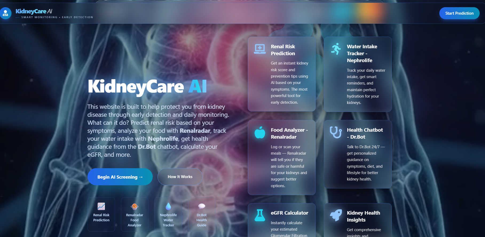
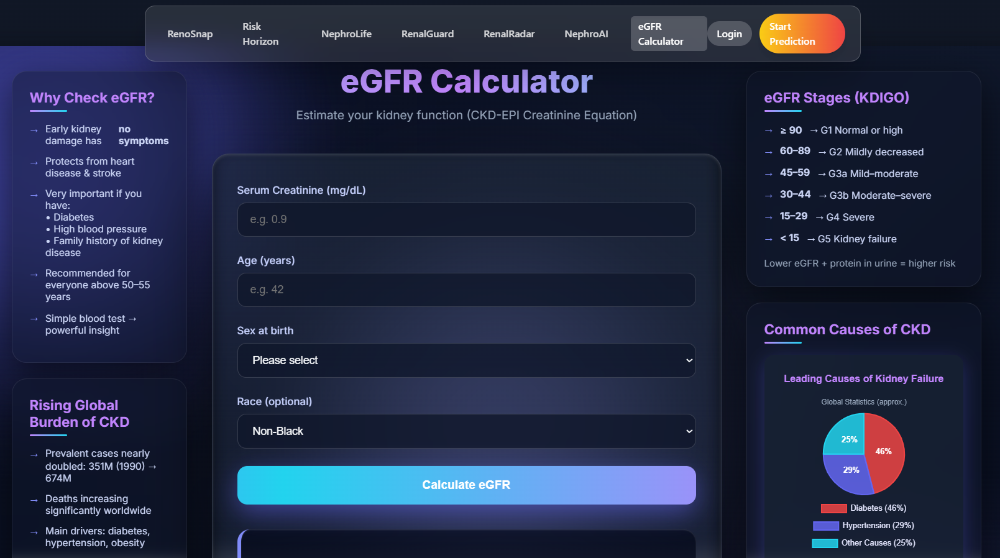
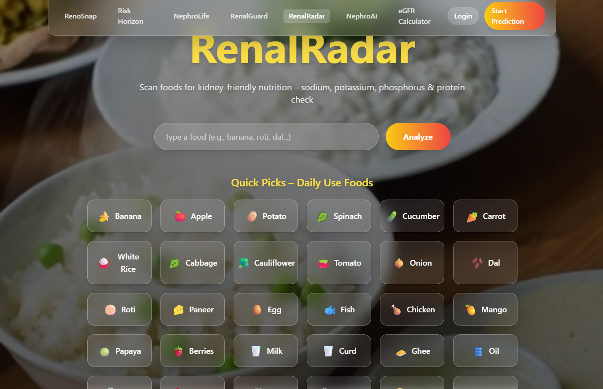
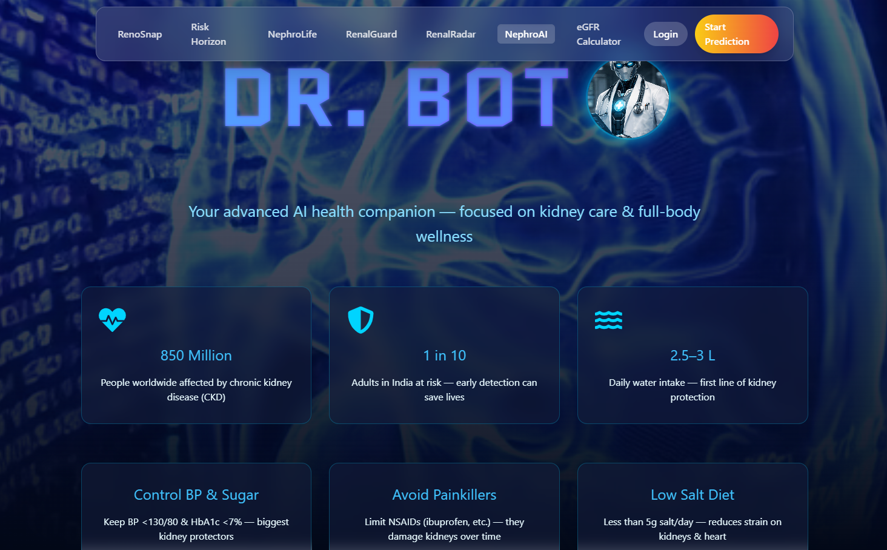
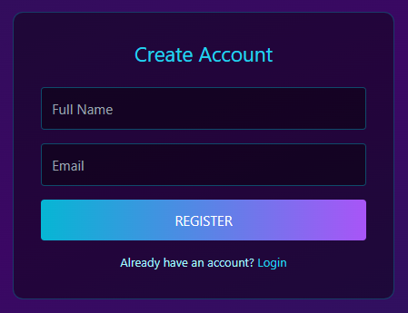
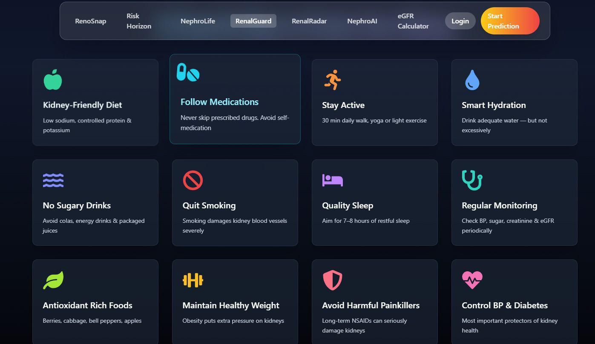
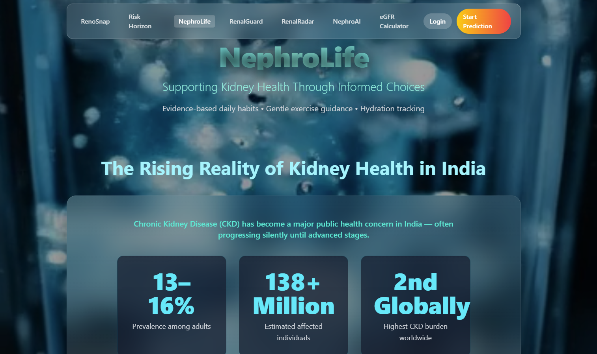

# NephroVision

NephroVision is an intelligent healthcare platform focused on kidney health prediction, patient assistance, and preventive care.

## Features

- Chronic Kidney Disease Prediction
- eGFR Calculator
- Food Risk Analyzer
- Water Intake Recommendation
- AI Health Chatbot
- Voice-enabled Medical Assistant
- LifeStyle & Diet Recommendation

---

## Tech Stack

### Frontend
- React.js
- Tailwind CSS
- JavaScript

### Backend
- Django
- Django REST Framework

### Machine Learning
- Scikit-learn
- Random Forest
- SVM
- KNN
- Decision Tree
- XGBoost

---

## Project Structure

```bash
NephroVision/
│
├── frontend/
├── backend/
├── models/
├── datasets/
└── README.md
```

---

## Installation

### Frontend

```bash
cd frontend
npm install
npm start
```

### Backend

```bash
cd backend
pip install -r requirements.txt
python manage.py runserver
```

---

## ML Features

- CKD Risk Prediction
- Water Intake Recommendation
- Food Safety Classification
- Kidney Health Monitoring

---

## Future Improvements

- Live Doctor Consultation
- Cloud Deployment
- Real-time Monitoring
- Mobile Application
- Advanced AI Diagnostics

## 📱 Screenshots









---

## Author

Apsara Rout